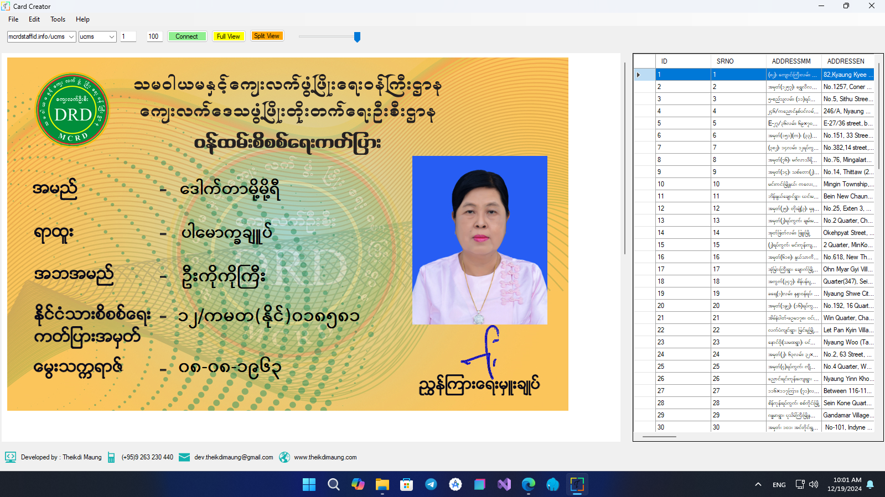
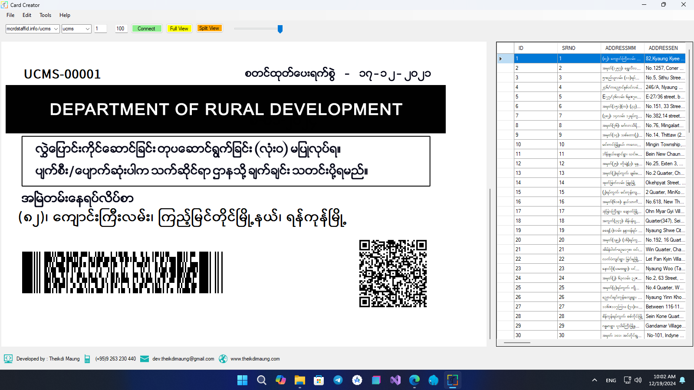

# CardCreator

**CardCreator** is a desktop application built with **C#** that enables users to create and manage cards efficiently. This application integrates with **MySQL** for data storage and allows importing/exporting data through **Excel**.

## Features

- **Card Creation:** Easily create customized cards.
- **MySQL Integration:** Save and retrieve card data from a MySQL database.
- **Excel Support:** Import data from Excel files and export card data to Excel.
- **User-Friendly Interface:** Intuitive design for seamless user experience.
- **Batch Processing:** Handle multiple cards simultaneously.

## Requirements

### Software Requirements
- Windows 10 or higher
- .NET Framework 4.7.2 or higher
- MySQL Server (5.7 or later)

### Dependencies
- MySQL.Data (for MySQL database connectivity)
- ClosedXML (for Excel file handling)

## Installation

1. Clone the repository:
   ```bash
   git clone https://github.com/MaungTheikdi/CardCreator.git
   ```

2. Open the project in Visual Studio.

3. Restore NuGet packages.

4. Configure the database connection in the application settings file:
   ```json
   {
       "ConnectionString": "Server=your_server;Database=your_database;User Id=your_username;Password=your_password;"
   }
   ```

5. Build and run the application.

## Usage

1. **Set Up Database:** Ensure your MySQL database is configured and running.
2. **Import Data:** Use the import feature to load card details from an Excel file.
3. **Create Cards:** Use the application interface to design and create cards.
4. **Print/Save Cards:** Save your card as jpg or print card.

## Screenshots


### Card Design View Front


### Card Design View Back


## Contributing

Contributions are welcome! To contribute:

1. Fork the repository.
2. Create a new branch.
3. Commit your changes.
4. Push to the branch.
5. Create a Pull Request.

## License

This project is licensed under the MIT License. See the [LICENSE](LICENSE) file for details.

## Contact

For any inquiries, feel free to contact me:

- **Name:** Theikdi Maung
- **Email:** [hello@theikdimaung.com](mailto:hello@theikdimaung.com)
- **GitHub:** [MaungTheikdi](https://github.com/MaungTheikdi)

---

Happy Coding!
